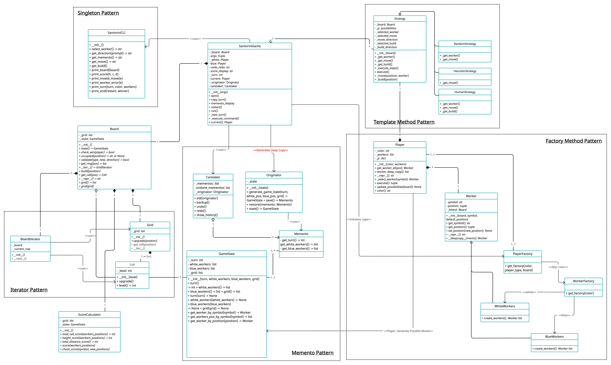

# Santorini Board Game
[![License: MIT][license-image]][license]

Santorini Board Game is the final test of **"Object Oriented Programming (CPSC 327)"**, course of **"Yale University"** held at Timothy Barron (2022).

**Teacher: Timothy Barron**

## Project specification
The project consists of a OOP Python version of the board game *Santorini*, made by Roxley Games. It implement 5 patterns: Factory method, Template Method, Memento Pattern, Iterators, and Singleton Pattern.

You can find the full game [here](https://roxley.com/products/santorini).

The final version includes:
* UML diagram;
* source code of the implementation;
* source code of unity tests.

)

## Final UML

## Implemented Functionalities
| Functionality | Status |
|:-----------------------|:------------------------------------:|
| Basic rules | [✅] |
| Complete rules | [✅] |
| Socket |[✅] |
| GUI | [⚠️] |
| CLI |[✅] |
| Heuristic/Random/Human | [✅] |
| Multiple games | [✅] |
| Persistence | [⛔] |
| Undo/Redo Function | [✅] |

#### Legend
[⛔]() Not Implemented &nbsp;&nbsp;&nbsp;&nbsp;[⚠️]() Implementing&nbsp;&nbsp;&nbsp;&nbsp;[✅]() Implemented

## The Team
* [Anton Melnychuk](https://github.com/anton-mel)
* [Oliver Li](https://github.com/revilobug)

[license]: https://github.com/S0NN1/ing-sw-2020-piemonti-pirovano-sonnino/blob/master/LICENSE
[license-image]: https://img.shields.io/badge/License-MIT-blue.svg
[javadocs]: https://s0nn1.github.io/santorini-javadocs/
[installation-link]: https://github.com/S0NN1/ing-sw-2020-piemonti-pirovano-sonnino/wiki/Installation
[installation-image]: github/Artboard%201.png
[compiling-image]: github/Artboard%203.png
[compiling-link]: https://github.com/S0NN1/ing-sw-2020-piemonti-pirovano-sonnino/wiki/Compiling
[running-image]: github/Artboard%204.png
[running-link]: https://github.com/S0NN1/ing-sw-2020-piemonti-pirovano-sonnino/wiki/Running
[troubleshooting-link]: https://github.com/S0NN1/ing-sw-2020-piemonti-pirovano-sonnino/wiki/Troubleshooting
[troubleshooting-image]: github/Artboard%205.png
